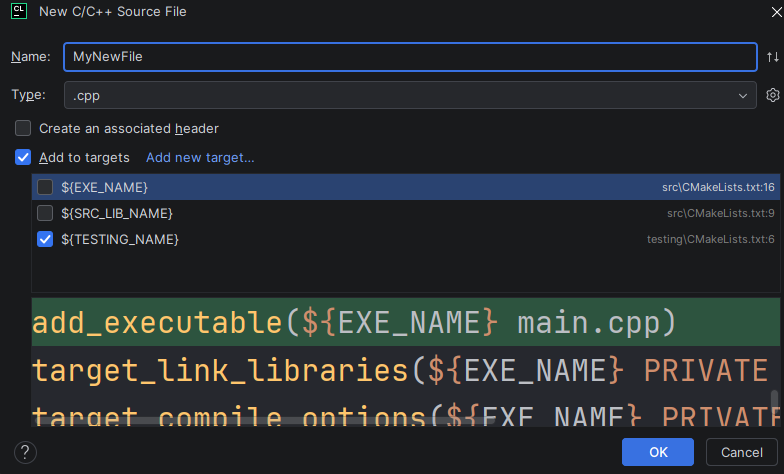

# Top Common Words

## Goals

- Practice using containers
- Practice reading from a file
- Optionally practice using ranges, views, and the algorithms libraries to write
  "more expressive" code

## Matthew’s Stats

- Time Taken: 40 minutes
- Files: 6
- Lines of Code: 274 including blank lines, comments, and header files

## Restrictions and Requirements

- No global variables may be used
- Your submission must contain at least 2 or more `.cpp` files and one or more `.h` files
- Your submission must have at least 3 user-defined functions in it in addition to `main`

## Problem Description

Write a program that displays the top N most occurring words in a file along
with the number of times the word appeared.

- Words should be displayed from most commonly occurring to least commonly occurring
- A "word" is considered to be 1 or more consecutive nonwhitespace characters
- Case does not matter when counting words
    - `HELLO` and `hello` are to be considered the same word
- When displaying the most commonly occurring words they should all be displayed in lowercase
- When counting a word all leading and trailing non-alphabetical, non-numeric characters should be removed
  for a more accurate count
    - For example, the following words are considered to be the word `hello`
        - hello
        - hello,
        - hello.
        - hello;
        - !!$#%hello<>?/
    - The complete list of special characters is: ```\,.:;"|!@#$%^&*()_+-=[]{}<>?/~`'```
- If multiple words tie for most commonly occurring they should all be displayed
    - These words should be displayed in alphabetical order
- You should ignore the following words when counting the most commonly occurring words because they are so frequent and
  aren't interesting
    - a, an, and, in, is, it the
- If there are fewer than N unique occurrences of a word all words should be displayed
    - For example, if there were 5 unique words in a file but the
      user asked to display the top 10 words, then only the top 5 will be displayed
      as there are only 5 words in the file

## Input

- All input will be valid

### Command Line Arguments

1. The path to the file
    - Required
2. `N`, the number of top words to find
    - Optional
    - If N is not given it should default to 10

## Reading From Files

In case we haven't covered how to read from a file in C++ by the time this assignment is realeased,
here's how to do that. 

```c++

#include <fstream> // This is the header file for file interaction

std::ifstream file(path_to_file); // this will open the file for reading
// at this point file is an istream linked to your file
// and anything you could do to std::cin to read you can now do with file

std::string word;
file >> word; // read the next "word" from the file

int num;
file >> num; // attempt to parse the next value in file as an int and store in num

std::string line;
std::getline(file, line); //read the next line from the file

//two ways to read through all the words of a file

//option 1
while (file >> word) {
    //do something with word
}

//option 2. Need to include ranges for this
for (const auto& word: std::ravges::views::istream<std::string>(file)

```

## Hints

1. When opening the file to read from, make sure to use only an `ifstream` and not a `fstream`.
   This is because you only have read permissions on the files when you submit for testing and opening a file with
   a `fstream` requires both read and write permissions. Since you don’t have write permissions,
   attempting to open a file with a `fstream` during testing will cause you to fail with weird behavior, as the file
   will
   fail to open.
2. The [algorithm](https://en.cppreference.com/w/cpp/algorithm.html) and
   [ranges](https://en.cppreference.com/w/cpp/ranges.html) libraries contains many useful functions
   for helping to solve this problem and write your solution in "expressive, modern C++".
    - For the ranges library, it can be very cumbersome and annoying to have to constantly write
      `std::ranges::views`.
        - You can simplify this by using namespace aliases.
            - `namespace r = std::ranges;`
            - `namesace rv = r::views`
        - Or by using the `using` statement to bring the desired items into the current namespace
            - `using std::ranges::views::enumerate, std::ranges::views::tranfsform;`
3. You will find `map`s to be incredibly useful in solving this problem
   - By default, a map will sort the values in ascending order (small to large).
     You can change this by providing a comparator function. Take a look back at the example we did in class
     for a refresher on how to do this.
4. To make your function that processes the contents of the file a bit more testable, have it
   accept an `std::istream&`, instead of the name of file or passing it an `ifstream&`.
   An `istream` is the generalization of a stream of values. This means that if your 
   function accepts an `istream` it could be passed an `ifstream&`, `std::cin`, a `std::stringstream&`, or any other
   class that implements the `istream` interface. `stringstreams` are going to be easier to generate 
   the values of during testing, and it does make your function more flexible, so it is the better route to go.
    - An example of generating `stringstream` values is in the testing folder.

## Example

Assume that `shake_it_off.txt` contains the lyrics to Taylor Swift's song "Shake it Off" which can be found
in [sample_inputs/shake_it_off.txt](sample_inputs/shake_it_off.txt)

```terminaloutput
./TopCommonWords shake_it_off.txt 5 
1.) These words appeared 78 times: {shake}
2.) These words appeared 70 times: {i}
3.) These words appeared 44 times: {off}
4.) These words appeared 21 times: {gonna}
5.) These words appeared 15 times: {break, fake, hate, play}
```

## CLion Specifics

### Setting Command Line Arguments
Command line arguments can be set by
1. Going to the configuration you want to add command line arguments to
2. Clicking  `...` next to the configuration
3. Selecting `Edit...`
4. Entering your command line arguments in `Program Arguments`

## What to Submit

Submit to GradeScope a clone of this repository with updates to it to solve the problem described.
You are allowed to create as many new files under `src` or `testing` as you
desire.

- If you create new files under `src` make sure to add them to `${SRC_LIB_NAME}`
    - 
- If you create new files under `testing` make sure to add them to `${Testing_Name}`
    - 
